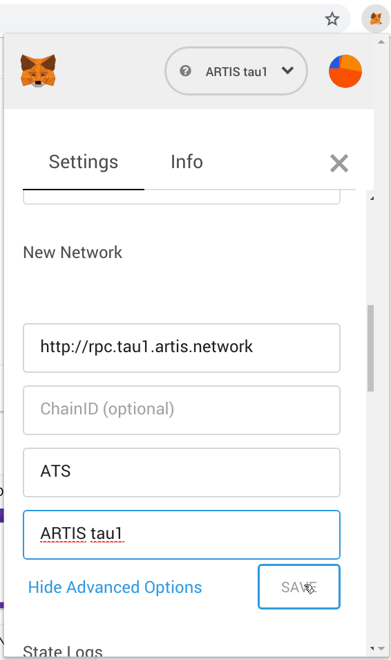

# How to ...

## Run a node

**Prepare**  
```
git clone https://github.com/lab10-coop/sigma1
cd sigma1
./download-parity.sh
```

**Run**    
`./parity -c node.toml`

## Run a trustnode

**Create a user**  
This step is optional.  
For the smoothest setup journey (least changes necessary), create a user named "artis".  
Execute as root:
```
adduser --disabled-password artis
su artis
cd
```
Now you are in directory `/home/artis` as user `artis`.  
In case you prefer to have an account which allows login with password, omit `--disabled-password` and make sure you're using a strong password!
  
**Prepare**
```
git clone https://github.com/lab10-coop/sigma1
cd sigma1
./download-parity.sh
```

**Create an account**  
```
./parity -c node.toml account new
```
This will ask you for a password. Hint: use [pwgen](https://linux.die.net/man/1/pwgen)  
After entering the password twice, there will be a new file (a JSON formatted _keystore_ file) in `data/keys/sigma1.artis/`. You should make a backup of that file!

Now, create a file `password.txt` and paste the password into it.

(If you prefer another method for creating the mining key, feel free to do so.)

**Adapt the config**  
* Copy `trustnode.toml.example` to `trustnode.toml`.
* Open `trustnode.toml` with your favourite editor and set the missing values for _identity_, _unlock_ and _engine_signer_ (see inline comments and examples)

**Initial run**  
`./parity -c trustnode.toml`  
On first run, Parity creates a _node key_ which is stored in `data/network/key`. This key, the IP address and P2P port are combined to an _enode_ (more details [here](https://github.com/ethereum/wiki/wiki/enode-url-format)) which uniquely identifies your node. Your node's enode is printed to the console after a few seconds.  
Example: `enode://1e795a8ecedf7e2509a3ecc86ef5fa08a35828abeb5edf02a8dd8139250bd5ec286d34e367461b64e01bced15fed4ca273e03b4cd1326c353bb99b47fb3a3b39@94.130.160.209:30303`
Make sure the contained IP address is Internet routable (if your host system has multiple network interfaces / IPs, Parity may not choose the correct one) and that the selected port (default: 30303) is accessible from the outside (not blocked by a firewall).  
Please copy the enode and communicate it in the trustnode operator chat channel.  

If Parity started syncing the chain, you can stop it with Ctrl-C and proceed with the next step.

Warning: When starting a trustnode which isn't yet allowed to create blocks, you may see entries like this in the parity log:
```
Dec 11 12:32:05 your.hostname parity[7400]: 2018-12-11 12:32:05 UTC Closing the block failed with error Error(Engine(FailedSystemCall("Cannot decode address[]")), State { next_error: None, backtrace: InternalBacktrace { backtrace: None } }). This is likely an error in chain specificiations or on-chain consensus smart contracts.
```
Don't worry, this is without consequences and usually goes away once your trustnode starts producing blocks (which is the case once your _mining key_ was added to the [validator set](https://wiki.parity.io/Validator-Set.html)).

**Keep running**  
A trustnode is supposed to be always on, thus running it in an interactive shell isn't the best option.  
This repository includes a systemd template config you can use to make parity a system service.  
The following steps require root privileges (sudo):  
* Copy `artis-sigma1-parity.service.example` to `/etc/systemd/system/artis-sigma1-parity.service` (if that directory doesn't exist, you're likely not using systemd and can't use this method).
* Open the copied file and set _User_, _Group_, _WorkingDirectory_ and _ExecStart_ to values matching your setup
* Start the service: `systemctl start artis-sigma1-parity`
* Enable start-on-boot: `systemctl enable artis-sigma1-parity`

Finally, make sure the service is running: `systemctl status artis-sigma1-parity`.  
In order to see a live log, do `journalctl -f -u artis-sigma1-parity` (Ctrl-C will get you back).

## Get listed in status dashboard

There's a nice network status dashboard at https://status.sigma1.artis.network/  
It only lists nodes which want to be listed.  
In order to be on the list, a dedicated status reporting application needs to run alongside parity.  

If you run a public node which is always on (be it a trustnode or not), please get it listed.  
In case you decide to get listed, please ask for the _secret key_ needed to connect to the service (since the dashboard service shows whatever data it gets from connected nodes, this kind of permissioning helps to protect it against anonymous trolls feeding it with manipulated data).

**Prepare**  
Check which version of nodejs you have installed (if any):
`node --version`  
Anything newer than v6 should do.

If you don't have it installed, your options depend on the operating system.

_Ubuntu 18.04_:  
`apt install nodejs`

_Ubuntu 16.04_:  
```
curl -sL https://deb.nodesource.com/setup_10.x -o nodesource_setup.sh
bash nodesource_setup.sh
apt install nodejs
```
(Of course you can take a look into `nodesource_setup.sh` before executing it with root permissions.)

**Install**  
Next, get the application.  
```
cd
git clone https://github.com/lab10-coop/node-status-reporter
cd node-status-reporter
npm install
```

**Test run**  
Now you _could_ run it with  
`NODE_ENV=production INSTANCE_NAME=<your instance name here> WS_SERVER=https://status.sigma1.artis.network WS_SECRET=<SECRET-KEY> npm start`  

**Keep running**

If you installed a service for parity, you should do the same for this application. With root privileges, do:
* Copy `artis-sigma1-statusreporter.service.example` to `/etc/systemd/system/artis-sigma1-statusreporter.service`.
* Open the copied file and adapt it to your needs. Important: set the secret key for _WS_SECRET_, also set values for _INSTANCE_NAME_ and _CONTACT_DETAILS_, then uncomment them.
* Start the service: `systemctl start artis-sigma1-statusreporter`
* Flag service to be started on boot: `systemctl enable artis-sigma1-statusreporter`

You can check the status of the service with `systemctl status artis-sigma1-statusreporter`.

## use with Metamask

[Metamask](https://metamask.io/) is a browser extension which implements an Ethereum wallet. It can be used with any Ethereum compatible network.  
Once you have Metamask installed:
* Open and unlock Metamask
* Click the _Networks_ dropdown and choose _Custom RPC_
* For _RPC URL_, enter "https://rpc.sigma1.artis.network"
* (optional, but convenient) Click _show advanced options_, then enter "ATS" for _Symbol_ and "ARTIS sigma1" for _Nickame_
* Click _SAVE_



Note that Metamask is still beta software and sometimes behaves in weird ways.  
For use with ARTIS Sigma1, we recommend to set up a fresh instance of Metamask which is used for this chain only.

# About

Σ1 is an ARTIS mainnet.  
It makes use of several open source contributions of the fantastic Ethereum community, most importantly those of [poa.network](https://github.com/poanetwork/) and [Paritytech](https://github.com/paritytech/).

For convenience, this directory contains a script downloading a binary provided by Paritytech. Instructions for building from source can be found [here](https://github.com/paritytech/parity-ethereum).  
Newer versions of Parity are expected to be compatible (able to sync with this chain). Versions older than 2.0.8 are known to be incompatible with this chain.
